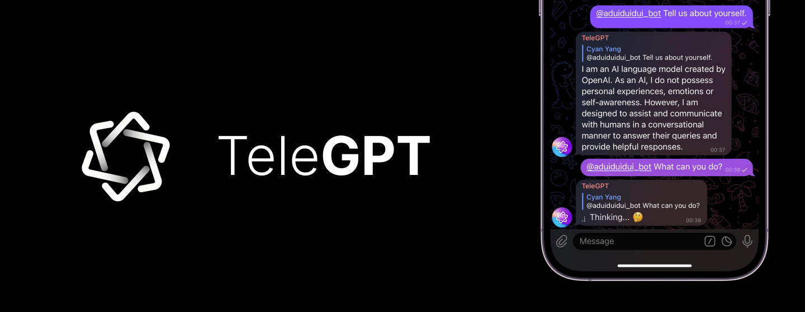

# TeleGPT

[API Docs](https://icystudio.github.io/TeleGPT/telegpt_core) | [Releases](https://github.com/IcyStudio/TeleGPT/releases) | [Twitter](https://twitter.com/unixzii)



An out-of-box ChatGPT bot for Telegram.

TeleGPT is a Telegram bot based on [**teloxide**](https://github.com/teloxide/teloxide) framework and [**async_openai**](https://github.com/64bit/async-openai). It provides an easy way to interact with the latest ChatGPT models utilizing your own API key.

## Features

🦀 Lightning fast with pure Rust codebase.<br>
📢 Private chat and group chat supports.<br>
🚀 Live streaming tokens to your message bubble.<br>
💸 Token usage statistic recording and queryable via commands.<br>
⚙️ File-based configuration and fully customizable.<br>
✋ User access control supports.

## Getting TeleGPT

### Download from release

We recommend you to download the pre-built binary directly from the [releases](https://github.com/IcyStudio/TeleGPT/releases) page. Currently, Linux and macOS (Intel and Apple Silicon) hosts are supported.

### Build from source

Clone the repository and run:

```shell
$ cargo build --release
```

## Usage

You need to create a configuration file before running the bot. The program reads `telegpt.config.json` from your current working directory by default, and you can also specify the config file path via `-c` option.

The configuration is described in this [doc](https://icystudio.github.io/TeleGPT/telegpt_core/config/).

To start the bot, simply run:

```shell
$ /path/to/telegpt
```

When you see the message `Bot is started`, you are ready to go!

### Enable the verbose logging

For debugging purpose, you can enable the verbose logs by setting `RUST_LOG` environment variable. For example:

```shell
$ RUST_LOG=TRACE /path/to/telegpt
```

> **Note:** Users' input will be logged in `DEBUG` level. To protect user privacy, please don't enable it in the production environment.

## Roadmap

TeleGPT will be actively maintained recently, there are some planned features that are in development.

- [ ] Retry with exponential backoff.
- [ ] Conversation presets.
- [ ] More user-friendly interface for admin operations.
- [ ] Remote controlling with HTTP APIs.

## Contribution

Issues and PRs are welcomed. Before submitting new issues or PRs, it's better to check the existing ones first. Discussions and feature requests are nice to have before you start working on something.

## License

MIT
